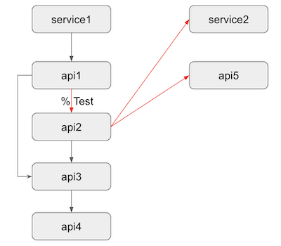
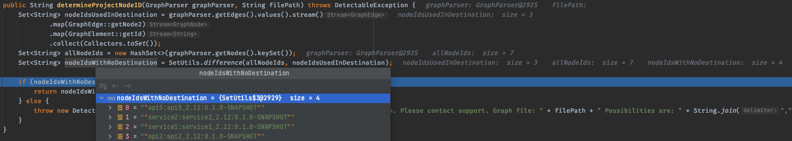

## Description
**NOTE:** Please see this repo as specific edge case we encountered in our code and here solely for the purpose of reproducing the issue and nothing else.

`sbt dependencyDot` command generates a graph nodes that are not connected when in fact those dependencies are being defined as `% Test` in `build.sbt` file.

Any transitive dependency, that comes with the module defined as `% Test`, will be a node in dependency graph but without any edge connection.

This behavior is possibly a bug inside SBT dependency tree code, although not sure and it may be intended.

Encountered this as a result of running BlackDuck scan, using recently added functionality, to scan project dependencies using `dependencyDot` command, without being required to recompile entire project.

## Intended Dependency Graph
Red lines shows the dependencies that are edgeless in the generated graph file.



To reproduce:
1. Clone the repository
2. Run `cd dependencies-dot-demo`
3. Run `sbt service1/dependencyDot`
4. See generated `dependencies-compile.dot` file.


## Testing through code
To test this, I've used [synopsis-detect](https://github.com/blackducksoftware/synopsys-detect) master branch.

Temporarily add this code just for testing into (https://github.com/blackducksoftware/synopsys-detect/blob/master/detectable/src/test/java/com/synopsys/integration/detectable/detectables/sbt/unit/SbtProjectMatcherTest.java)

```java
@Test
public void projectFromActualFile() throws DetectableException, IOException {
    File file = new File("<your code folder location>/dependencies-dot-demo/services/service1/target/dependencies-compile.dot");

    try {
        GraphParser graphParser = new GraphParser(FileUtils.openInputStream(file));
        SbtProjectMatcher projectMatcher = new SbtProjectMatcher(new SbtDotGraphNodeParser(new ExternalIdFactory()));
        String projectId = projectMatcher.determineProjectNodeID(graphParser, file.getAbsolutePath());
        System.out.println(projectId);
    } catch (GraphParserException | IOException | DetectableException e) {
        System.out.println(e.getMessage());
    }
}
```

The interesting part is inside `determineProjectNodeID` method.
Put a breakpoint inside it on `if (nodeIdsWithNoDestination.size() == 1)` line.
It will looks something like this.


Hope this helps. Feel free to open discussion about this.
